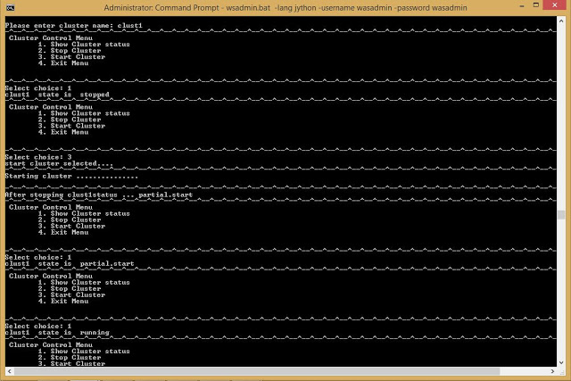
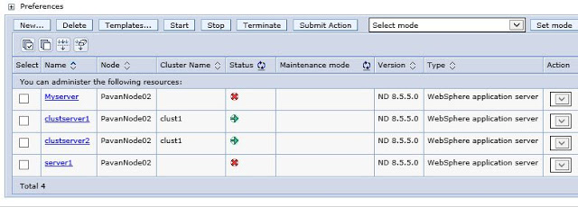

# Control the WebSphere Cluster using Jython
https://jython4wsadmin.blogspot.com/2015/10/control-websphere-cluster-using-jython.html

## Cluster State using Jython

You can get the state of the cluster using AdminControl object method getAttribute will give that. The cluster state might be one of the three common important states

* websphere.cluster.running
* websphere.cluster.partial.start
* websphere.cluster.partial.stopped
* websphere.cluster.stopped

Cluster object required to get the state of the cluster, AdminControl will gives us the state of the cluster getAttribute method will takes two argument cluster object and 'state' command.

```
Cluster = AdminControl.completeObjectName('cell='+ cell +',type=Cluster,name='+ cluster +',*')
state = AdminControl.getAttribute(Cluster, 'state')
```

## Start Cluster with Jython

To start the member servers of a cluster you need a clustername, that fetches the cluster object from a cell. After that using AdminControl we can start the cluster this will start all the member servers in the cluster.The invoke() method takes cluster object, control command 'start'. If the cluster state is already running then ripple start would be the best command.

```
AdminControl.invoke(Cluster ,'start')
AdminControl.invoke(Cluster ,'rippleStart')
```
Note: Corresponding node agent must be running where your cluster members are configured.

## Stop Cluster using Jython

Stopping the cluster is very simple it also uses AdminControl object invoke method with cluster object and control command as 'stop':

```
AdminControl.invoke(Cluster ,'stop')
```

## WebSphere Cluster controlling Jython script: stop, start Cluster

Using the above snippets with effective modular program structure to give task wise multiple functions the nice menu driven script as follows:

```py
#----------------------------------------------------------------
#  Author   : Pavan Devarakonda
#  Date updated : 22-Oct-2015
#  Script File  : ClusterControl.py
#----------------------------------------------------------------
import time
 
def printBorder(): print '-^-' * 45
def cls(): print "\n\r" * 80
#----------------------------------------------------------------
 
# Status of a cluster on all nodes in the cell
#----------------------------------------------------------------
def clusterStatus(Cluster):
 state = AdminControl.getAttribute(Cluster, "state" )
 statelist=['stopped', 'partial.stopped', 'running', 'partial.start']
 for s in statelist :
  if state.endswith(s): 
   return s
  
def startCluster(cell, Cluster):
 state = AdminControl.getAttribute(Cluster, 'state')
 printBorder()
 if (state == 'websphere.cluster.running'):
  print "Cluster is running\nRipple starting cluster ............."
  print AdminControl.invoke(Cluster ,'rippleStart')
 else:
  print "Starting cluster ............... "
  print AdminControl.invoke(Cluster ,'start')
 printBorder()
 time.sleep(30)  # waiting time in seconds you can change it according to your needs
   
def stopCluster(cell, Cluster):
 state = AdminControl.getAttribute(Cluster, 'state')
 if (state == 'websphere.cluster.running'):
  print AdminControl.invoke(Cluster ,'stop')
  time.sleep(30)
 else:
  print "Cluster cannot stopped"
 printBorder()
  
 
def menu():
 printBorder()
 print """ Cluster Control Menu
 1. Show Cluster status
 2. Stop Cluster
 3. Start Cluster
 4. Exit Menu
  
 """
 printBorder()
 choice=input("Select choice: ")
 return choice
#  Main program   
cls()
cellName=AdminControl.getCell()
cluster=raw_input("Please enter cluster name: ")
clusterObj = AdminControl.completeObjectName('cell='+ cellName +',type=Cluster,name='+ cluster +',*')
 
while 1:
 ch=menu()
 if ch == 1:
  print cluster, " state is ", clusterStatus(clusterObj)
 elif ch == 2:
  print "stopping the cluster member servers"
  stopCluster(cellName, clusterObj)
  print "After stopping "+ cluster +"status ...", clusterStatus(clusterObj)
 elif ch==3:
  print "start cluster selected...."
  startCluster(cellName, clusterObj)
  print "After stopping "+ cluster +"status ...", clusterStatus(clusterObj)
 elif ch==4: 
  print "Exit from menu..."
  break
```

The execution of the above cluster script conntype as SOAP based and it is connected with managed Cell of wsadmin Jython shell is as follows:
```
wsadmin>execfile('C:/Users/Raghav/Desktop/ClusterControl.py')
```




You can see the update on the IBM WebSphere integrated console as well the changes as below:

